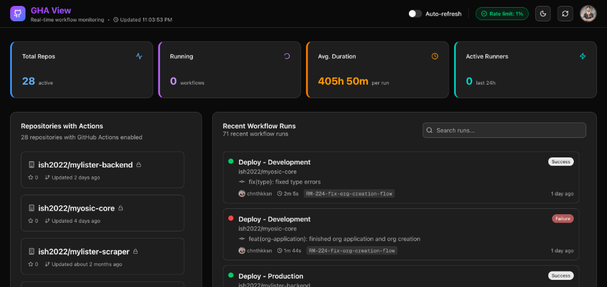

# GHA View 🚀

A beautiful, real-time monitoring dashboard for GitHub Actions workflows.

> **Why this exists**: We built this because viewing GitHub Actions across multiple repositories is surprisingly difficult and time-consuming in the default GitHub interface. This dashboard solves that by giving you a unified, auto-refreshing view of everything that's happening in your CI/CD pipelines.




## ✨ Features

- 🔐 **Secure Authentication** - GitHub OAuth + Passkey support with named devices
- 📊 **Real-time Dashboard** - Auto-refreshing workflow status (default: 60s)
- 🔍 **Smart Search** - Filter runs by repo, branch, user, or commit message
- ⚡ **Rate Limit Aware** - Smart tracking of your GitHub API usage to prevent lockouts
- 📈 **Instant Analytics** - Success rates, failure tracking, and run duration metrics
- 🌓 **Theme Support** - Beautiful dark and light modes
- 📱 **Responsive Design** - Works great on desktop and mobile

## 🚀 Getting Started

### Prerequisites

- Node.js 18+ and pnpm
- A GitHub account
- A GitHub OAuth App (for authentication)

### 1. Create a GitHub OAuth App

1. Go to [GitHub Developer Settings](https://github.com/settings/developers)
2. Click "New OAuth App"
3. Fill in the details:
   - **Application name**: GHA View
   - **Homepage URL**: `http://localhost:3000`
   - **Authorization callback URL**: `http://localhost:3000/api/auth/callback/github`
4. Register and copy your **Client ID** and **Client Secret**

### 2. Install & Configure

Clone the repo and install dependencies:

```bash
git clone https://github.com/yourusername/gh-action-web.git
cd gh-action-web
pnpm install
```

Set up your environment variables:

```bash
cp env.example .env.local
```

Edit `.env.local` to add your credentials:

```env
GITHUB_CLIENT_ID=your_client_id
GITHUB_CLIENT_SECRET=your_client_secret
NEXT_PUBLIC_GITHUB_CLIENT_ID=your_client_id  # Needed for frontend links
NEXT_PUBLIC_APP_URL=http://localhost:3000
MONGODB_URI=your_mongodb_uri
```

### 3. Run Locally

```bash
pnpm dev
# Server starts at http://localhost:3000
```

### 4. Deploy to Production

The easiest way to deploy is on **Vercel**:

1. Push your code to GitHub.
2. Create a new project on Vercel and select your repository.
3. Add your environment variables in the Vercel dashboard:
   - `GITHUB_CLIENT_ID`
   - `GITHUB_CLIENT_SECRET`
   - `NEXT_PUBLIC_GITHUB_CLIENT_ID`
   - `MONGODB_URI`
   - `BETTER_AUTH_URL` (e.g., `https://your-project.vercel.app`)
   - `NEXT_PUBLIC_APP_URL` (e.g., `https://your-project.vercel.app`)

> **Note**: Make sure to update your GitHub OAuth App's "Authorization callback URL" to match your production domain: `https://your-project.vercel.app/api/auth/callback/github`

## 🛠️ Development & Contributing

This project is built for fun and personal utility, but contributions are welcome!

### Troubleshooting

- **Auth Error**: "Callback URL mismatch" -> Ensure your GitHub OAuth App settings match your `BETTER_AUTH_URL`.
- **Rate Limited**: "API rate limit exceeded" -> Close some tabs or check your "API Usage" card. Authenticated requests get 5,000/hour.
- **Database Connection**: Ensure your IP is allowed in MongoDB Atlas "Network Access".

### Core Concepts

- **Tech Stack**: Next.js 16 (App Router), TypeScript, Tailwind CSS, Shadcn UI
- **Auth**: [Better Auth](https://better-auth.com/) handles sessions, OAuth, and Passkeys.
- **Data Fetching**: We use SWR-like patterns with custom hooks (`use-github-data.ts`) to poll GitHub's API.

### Project Structure

```
app/
  dashboard/       # Main authenticated view
  api/             # Backend routes acting as proxy to GitHub
components/
  dashboard/       # Dashboard widgets (Stats, WorkflowRuns, etc.)
  ui/              # Reusable Shadcn components
lib/
  auth.ts          # Auth configuration
  github.ts        # Typed GitHub API client
```

### ⚠️ API Rate Limits

This dashboard hits the GitHub API frequently to provide real-time updates.

- **Authenticated limit**: 5,000 requests per hour.
- **Monitoring**: Check the "API Usage" card in the dashboard header to see your remaining quota.
- **Optimization**: The app uses `If-Modified-Since` headers where possible to save quota, but keeping many tabs open will consume it faster.

## 🤝 Contributing

1. Fork the Project
2. Create your Feature Branch (`git checkout -b feature/AmazingFeature`)
3. Commit your Changes (`git commit -m 'Add some AmazingFeature'`)
4. Push to the Branch (`git push origin feature/AmazingFeature`)
5. Open a Pull Request

## 📝 License

MIT License.

---

_Verified with Next.js 16 & React 19._
